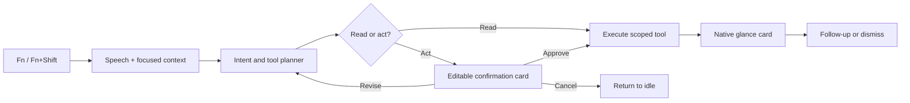

# Whisperino voice assistant rebuild

Status: Phase 1 complete; Phase 2 typed tools and confirmation runtime live on `codex/voiceos-rebuild`
Research date: 2026-08-12

## Product thesis

Whisperino should keep dictation fast and dependable, then add an agent loop
that treats voice as connective tissue between the user, the screen, local Mac
capabilities, and authorized services. Voice does not replace the mouse or
keyboard. It lets the user state intent while cursor focus, selected text, the
frontmost app, and the current screen disambiguate that intent.

The essential loop is:



The host application—not an LLM or an integration—owns confirmations, secret
storage, tool permissions, and card rendering.

## VoiceOS capability inventory

The public product and documentation describe three primary modes:

1. **Dictate** — fast speech-to-text with filler removal, corrections, custom
   vocabulary, replacements, and app-aware formatting.
2. **Edit** — operate on selected text using a voice instruction.
3. **Agent** — reason over screen context, call one or more tools, keep longer
   jobs running, and return compact results.

The integration catalog spans local apps and remote services: Finder, Messages,
Mail, Notes, Reminders, Calendar, Gmail, Google Calendar, Google Drive/Docs/
Sheets, Slack, Notion, Linear, Jira, Maps, Spotify, coding agents, and custom MCP
servers. Read actions may run immediately; actions with effects stop at an
editable confirmation card. Results are rendered as compact native cards, with
sandboxed widgets reserved for richer interactions.

Sources used for this inventory:

- [VoiceOS Agent](https://www.voiceos.com/features/agent)
- [VoiceOS Dictation](https://www.voiceos.com/features/dictation)
- [VoiceOS app catalog](https://www.voiceos.com/app-store)
- [Integration architecture](https://docs.voiceos.com/integrations/how-it-works)
- [Tool contract](https://docs.voiceos.com/integrations/tools)
- [Confirmations](https://docs.voiceos.com/integrations/confirmations)
- [Result cards](https://docs.voiceos.com/integrations/result-cards)
- [Privacy model](https://www.voiceos.com/privacy)

This is a capability study, not a pixel-for-pixel or brand copy. Whisperino
should retain its own name, visual identity, implementation, and product voice.

## What Whisperino already has

- Local whisper.cpp transcription with rolling long-form chunks.
- Global Fn and Fn+Shift interaction, including hold and latched recording.
- App-aware paste and optional auto-submit through Accessibility.
- ScreenCaptureKit context for one-shot AI requests.
- Custom vocabulary, snippets, transcript history, and Langdock agents.
- A persistent, non-activating overlay across Spaces and fullscreen apps.
- Local audio-device selection and recovery from device churn.

The largest gap is structural: AI mode currently returns text directly to the
focused field. There is no typed tool runtime, durable task model, trusted
confirmation boundary, integration lifecycle, or rich result surface.

## Target architecture

### 1. Interaction state machine

Replace boolean mode combinations with one explicit session model:

```swift
enum AssistantSessionPhase {
    case listening(mode: InteractionMode)
    case transcribing
    case planning
    case awaitingConfirmation(PendingAction)
    case executing(ToolInvocation)
    case presenting(ToolResult)
    case background(BackgroundTask)
    case failed(AssistantError)
}

enum InteractionMode { case dictate, editSelection, agent }
```

Each session receives a cancellation token. Late audio, model, OAuth, and tool
callbacks must prove they still belong to the active session before mutating UI.

### 2. Context broker

Collect only the context required by the chosen mode:

- frontmost application and focused window;
- cursor position and element beneath it where Accessibility exposes one;
- selected text and editable-field metadata;
- a focused-window screenshot or user-drawn region;
- explicitly attached local files;
- recent turns from the current session only.

Every context item carries provenance and a retention policy. The UI should
show which inputs are being used before a sensitive request is sent.

### 3. Typed tool runtime

Define a single interface for native, OAuth, and MCP-backed capabilities:

```swift
protocol AssistantTool {
    var descriptor: ToolDescriptor { get }
    func prepare(_ arguments: JSONValue, context: ToolContext) async throws
        -> PreparedInvocation
    func execute(_ invocation: PreparedInvocation) async throws -> ToolResult
}
```

`ToolDescriptor` includes an input schema, read/act classification, required
permissions, timeout, privacy label, and result-card hint. The planner can only
choose registered descriptors; it never emits arbitrary shell or Accessibility
commands. The runtime validates arguments again before execution.

### 4. Confirmation and result UI

The notch surface supports a deliberately small native vocabulary:

- header, text, key/value, list, stats, progress, badges, and actions;
- text field, picker, toggle, and chips for editable confirmations;
- optional sandboxed web widget for a use case native blocks cannot express.

Read-only calls can return a glance card immediately. Creating, sending,
deleting, moving, sharing, purchasing, or controlling another app requires a
confirmation by default. The card names the integration, exact target, changed
fields, and consequence. Approval originates only from host-owned UI or an
unambiguous voice response while that confirmation is active.

### 5. Notch and monitor behavior

- Prefer the built-in display's physical notch whenever that display is
  present—even if an external monitor owns the focused window.
- In clamshell mode or on Macs without a notch, render an equivalent compact
  island below the active monitor's menu bar.
- Listening remains a minimal waveform. Planning grows downward into status;
  confirmation and results become wider cards. Long-running tasks collapse to
  a side badge and can be reopened.
- Add a later preference: **Always MacBook notch**, **Follow active display**,
  or **External display island**.

### 6. Computer use

Computer control must be a constrained tool set backed by Accessibility and
ScreenCaptureKit:

- inspect focused app/window and selected text;
- locate a visible control by Accessibility role/title;
- focus, click, type, press a named key, scroll, open an app or URL;
- verify the postcondition with a new Accessibility snapshot or screenshot.

The first release should support observable, reversible actions inside a single
frontmost app. Cross-app workflows, visual-coordinate fallback, and background
automation follow only after replayable traces and recovery are in place. Any
destructive or communicative step pauses for confirmation.

### 7. Google Workspace

Use OAuth 2.0 authorization code flow with PKCE through
`ASWebAuthenticationSession`. Store refresh tokens in Keychain, never in the
settings JSON. Request incremental, least-privilege scopes and explain them at
the feature boundary. Disconnect revokes the grant where supported and deletes
local tokens.

Ship Google as separate providers behind the common runtime:

- **Gmail:** search/read, draft, reply/send, labels/archive/trash;
- **Calendar:** list/find availability, create/update/delete events;
- **Drive:** search/read metadata, download/upload/move/share/trash;
- **Docs/Sheets:** create/read/edit with structured operations.

Reads render immediately. Drafting may be read-like, but sending, modifying,
sharing, moving, and deleting always confirm. A production OAuth client ID,
redirect configuration, consent-screen verification, privacy policy, and test
accounts are external release prerequisites. Prefer Drive's per-file
`drive.file` scope with explicit file selection where the workflow permits it.
Voice search across an entire Drive requires broader sensitive/restricted
scopes, so that capability must ship only with the corresponding Google review
and, if restricted data is transmitted or stored server-side, security
assessment.

### 8. Custom integrations

After the native runtime is stable, support MCP over local stdio and remote
HTTPS. Each server receives an explicit allowlist of tools and capabilities.
Secrets are injected out-of-band; they are never placed in prompts or manifest
files. Integration output is data validated into host-rendered cards.

## Delivery plan

### Phase 0 — Reliability baseline

- Move CoreAudio startup off the main thread.
- Add bounded startup, cancellation, and stale-attempt protection.
- Resolve persistent device UIDs immediately before recording.
- Fix variable-sized `AudioBufferList` handling.

Acceptance: an unavailable/churned audio device cannot pin the hotkey run loop;
release/Escape recovers the UI; debug and release builds pass.

### Phase 1 — Native assistant vertical slice

- Notch-first overlay with external-display fallback.
- App-owned glance and confirmation cards.
- Local Finder search via Spotlight.
- Explicit confirmation before opening a result.

Acceptance: “Find my tax PDF” searches locally, returns up to eight results,
uploads no filenames, and opens nothing until the user approves.

### Phase 2 — Agent runtime

- Explicit session state, tool registry, schemas, planner, cancellation.
- Multi-step read workflows and compact execution trace.
- Follow-up turns scoped to a single visible session.
- Background task model with completion notification.

Acceptance: planner output cannot invoke an unregistered capability; every
side effect is represented by a prepared invocation and confirmation policy.

### Phase 3 — Context and computer use

- Selected-text edit mode.
- Accessibility context tree and cursor-target provider.
- Typed click/focus/type/scroll/open tools with postcondition checks.
- Screen-region selection and visible context disclosure.

Acceptance: a failed target lookup produces a recoverable card rather than a
blind click; sensitive/cross-app actions require approval.

### Phase 4 — Google Workspace

- OAuth/PKCE coordinator, Keychain token vault, scope manager, revoke flow.
- Gmail search/draft/send.
- Calendar availability/create/update.
- Drive/Docs search/read/create/edit.

Acceptance: read scopes work independently; adding a write feature requests
only its additional scope; expired tokens refresh; disconnect removes access;
all writes confirm.

### Phase 5 — Integration platform

- MCP local/remote transports, lifecycle, permissions, and health UI.
- Versioned card schema and optional sandboxed widgets.
- Integration gallery and setup flows.

### Phase 6 — Product hardening

- Structured privacy-safe traces, tool replay fixtures, and fault injection.
- Accessibility, VoiceOver, keyboard-only confirmation, localization.
- Signed/notarized distribution, OAuth production verification, migrations,
  crash/hang telemetry, and a staged beta.

## Work completed on this branch

- CoreAudio hang fix and stale-device recovery.
- Notch-first placement with physical-notch preference and external fallback.
- A true notch-attached silhouette on MacBook displays: the surface starts at
  the screen edge behind the camera housing, keeps controls inside the shape,
  and expands downward for listening, planning, results, and confirmation.
- Native assistant result and confirmation cards.
- Local, shell-safe Finder search using Spotlight.
- Explicit confirmation before `NSWorkspace` opens a selected result.
- Explicit assistant sessions with unique IDs, lifecycle phases, cancellation,
  and a compact execution trace.
- A typed JSON-value boundary, tool descriptors, argument schemas, read/action
  classification, and an allowlisted tool registry.
- Conservative local planning for Finder, Calendar event drafts, and web
  searches, plus screenshot-aware model planning into the same typed request
  boundary.
- EventKit-backed Calendar writes and default-browser searches, both held as
  immutable prepared invocations until the visible card is approved.
- Spoken request, live tool-status chip, native Finder table, calendar draft,
  web-search preview, and compact completion card inside the morphing notch.
- Immutable prepared invocations: the file approved by the user is the exact
  invocation executed after confirmation, with path and existence validation
  repeated at the runtime boundary.
- Runtime safety coverage for unknown tools, malformed arguments, local intent
  routing, and confirmation enforcement.

This proves the host-owned safety/UI loop and the core runtime contract. It is
not yet a model-driven multi-step chain, background-task engine, general
computer-use layer, OAuth integration, or full VoiceOS feature replacement.
